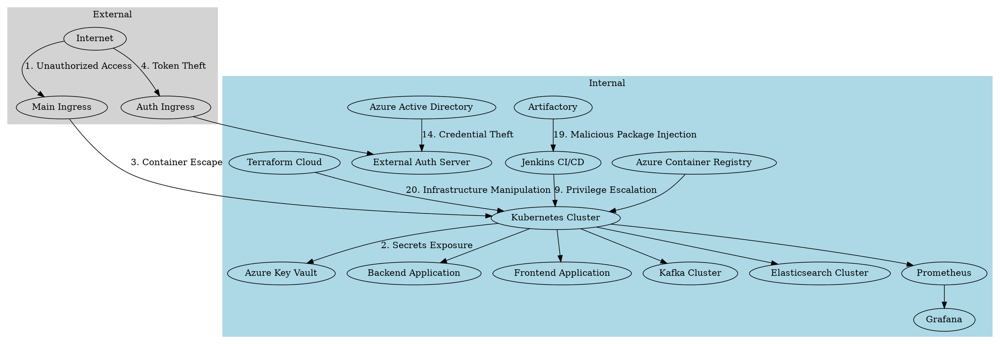

## MODEL GRAPH

```dot
digraph G {
    node [shape=ellipse];
    Internet [label="Internet"];
    MainIngress [label="Main Ingress"];
    AuthIngress [label="Auth Ingress"];
    K8s [label="Kubernetes Cluster"];
    ACR [label="Azure Container Registry"];
    KeyVault [label="Azure Key Vault"];
    AAD [label="Azure Active Directory"];
    Jenkins [label="Jenkins CI/CD"];
    TerraformCloud [label="Terraform Cloud"];
    Backend [label="Backend Application"];
    Frontend [label="Frontend Application"];
    Kafka [label="Kafka Cluster"];
    ES [label="Elasticsearch Cluster"];
    Prometheus [label="Prometheus"];
    Grafana [label="Grafana"];
    ExtAuth [label="External Auth Server"];
    Artifactory [label="Artifactory"];

    Internet -> MainIngress [label="1. Unauthorized Access"];
    Internet -> AuthIngress [label="4. Token Theft"];
    MainIngress -> K8s [label="3. Container Escape"];
    AuthIngress -> ExtAuth;
    K8s -> KeyVault [label="2. Secrets Exposure"];
    K8s -> Backend;
    K8s -> Frontend;
    K8s -> Kafka;
    K8s -> ES;
    K8s -> Prometheus;
    Prometheus -> Grafana;
    Jenkins -> K8s [label="9. Privilege Escalation"];
    TerraformCloud -> K8s [label="20. Infrastructure Manipulation"];
    AAD -> ExtAuth [label="14. Credential Theft"];
    Artifactory -> Jenkins [label="19. Malicious Package Injection"];
    ACR -> K8s;

    subgraph cluster_external {
        style=filled;
        color=lightgrey;
        node [style=filled,color=white];
        Internet;
        MainIngress;
        AuthIngress;
        label = "External";
    }

    subgraph cluster_internal {
        style=filled;
        color=lightblue;
        node [style=filled,color=white];
        K8s;
        ACR;
        KeyVault;
        AAD;
        Jenkins;
        TerraformCloud;
        ExtAuth;
        Artifactory;
        Backend;
        Frontend;
        Kafka;
        ES;
        Prometheus;
        Grafana;
        label = "Internal";
    }

    subgraph cluster_critical {
        style=filled;
        color=lightcoral;
        node [style=filled,color=white];
        KeyVault;
        AAD;
        label = "Critical Assets";
    }
}
```
